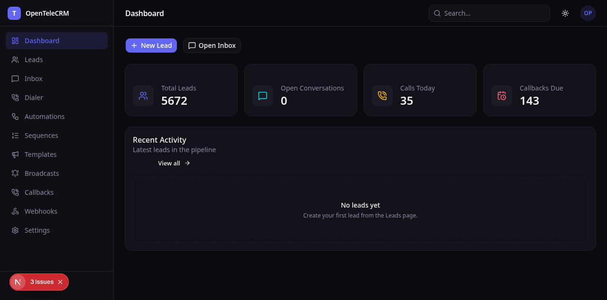
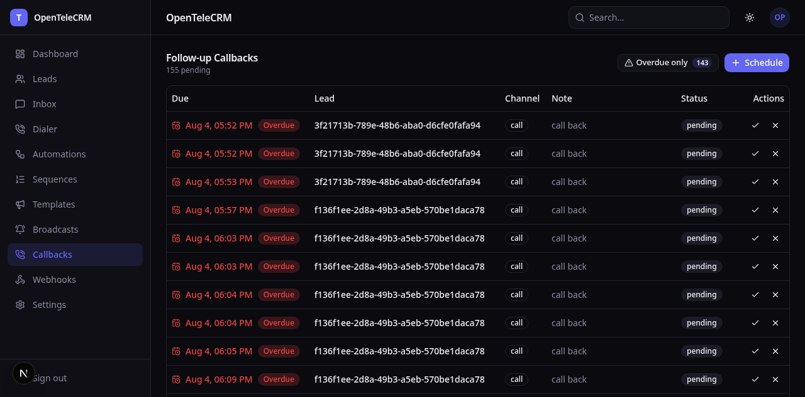
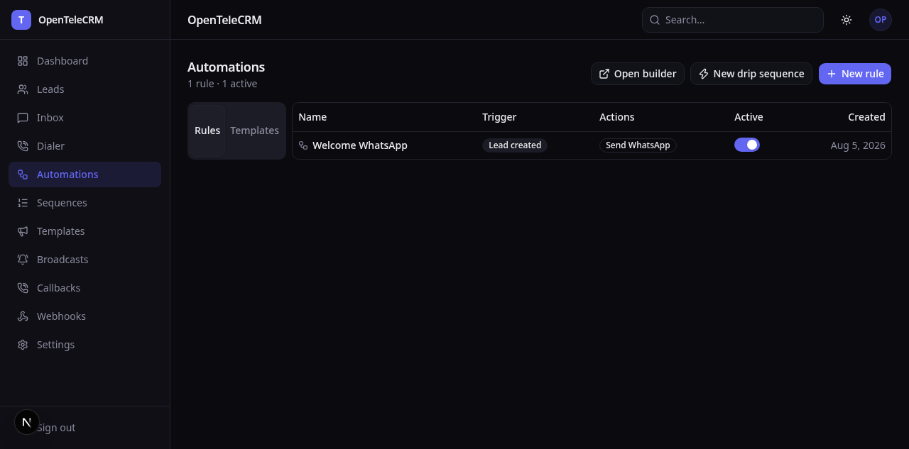

# OpenTeleCRM

**The self-hosted, drop-in replacement for TeleCRM.** A telecalling-first sales CRM for teams that live on the phone — leads, dialer, WhatsApp, automation — with your data on your hardware and an API your existing integrations already speak.


---

## Table of contents

- [What is OpenTeleCRM?](#what-is-opentelecrm)
- [See it in action](#see-it-in-action)
- [Features](#features)
- [Architecture](#architecture)
- [Quick start](#quick-start)
- [TeleCRM parity](#telecrm-parity)
- [Roadmap](#roadmap)
- [Documentation](#documentation)
- [Tunnel mode](#tunnel-mode)
- [Contributing](#contributing)
- [License](#license)

---

## What is OpenTeleCRM?

OpenTeleCRM is a **1:1 open-source clone of TeleCRM** — the telecalling-first sales
CRM used by thousands of Indian sales teams — rebuilt clean-room against the
documented API surface, self-hosted **natively** (no Docker), and multi-tenant
from line one.

It answers the three questions every telecalling operation asks:

| | |
|---|---|
| **🔐 Your data, your rules** | Runs on your hardware (Debian/Ubuntu, systemd, native binaries — no containers). Every table is tenant-isolated by PostgreSQL Row-Level Security, `FORCE`d so even the DB owner can't cross tenants. |
| **🔌 Wire-compatible, not look-alike** | The REST (`/autoupdate/v2`) and MCP surfaces match TeleCRM's API shapes, so existing integrations, scripts, and Postman/Bruno collections keep working — verified by a 27-request, 26-assertion Bruno collection that runs green against the live API. |
| **📞 Live channels, not mocks** | Real WhatsApp outbound through a standalone, deploy-anywhere Baileys bridge. Real calls through a source-built Asterisk 21 PBX over ARI, with caller-ID, callbacks, and TRAI-window-aware dialer scoring. |

The parity promise is **compatible surface, not bug-compatible behavior**: where
TeleCRM silently drops async writes, caps tokens at 3, or expires MCP tokens in
30 days with no renewal, OpenTeleCRM deliberately fixes it (see
[docs/PARITY.md § Divergences](docs/PARITY.md)).

## See it in action

Agent desk (dark theme) — dashboard, callbacks queue, automation rules, all
rendered against the seeded demo workspace:







## Features

| Area | What you get |
|------|--------------|
| **Multi-tenant foundation** | 28 RLS-`FORCE`d tenant tables, `withTenant()` transaction wrapper, deterministic seed (1 enterprise · 5,000 leads · 3 users · 2 pipelines · 20 custom fields) |
| **Sync API** | TeleCRM-parity `POST/GET/PUT/DELETE` under `/autoupdate/v2` — leads CRUD + upsert-by-identifier + search, actions batch CRUD, team members, custom fields/actions — with per-item `CREATED\|IGNORED\|UPDATED\|REJECTED` status + `remarks[]` |
| **Async API** | Fire-and-forget `autoupdatelead` → `requestId`, `?validate=true` dry-run (zero writes), `X-Strict-Mode` 422, ingest log + per-field outcomes |
| **MCP server** | 13 TeleCRM-parity tools (Streamable HTTP, RLS-scoped) — drive the CRM from Cursor, Claude, or any MCP client |
| **WhatsApp** | Send, unified inbox with auto lead-attribution, templates, broadcasts with consent ledger, drip sequences — plus a **standalone bridge** (Baileys 7.x, own session + queue) you can deploy on any Linux box |
| **Telephony** | Smart dialer (score + TRAI-window + DND suppression), live caller-ID, follow-up callbacks, call tracking, recordings (signed URLs) — **live calls via Asterisk ARI** |
| **Automation** | Pure-TS rule engine, 9 event kinds, 10 action executors, lead distribution (round-robin / least-loaded / skill-match), public webhooks + replay, 60s scheduler, per-tenant quota metering, 10 seeded templates, **React Flow visual builder** |
| **Web agent desk** | Next.js app: dashboard with real stats, leads (search/filter/score), dialer call pad, WhatsApp inbox, automations + builder, sequences, templates, broadcasts, callbacks, webhooks, settings |
| **Mobile app** | Kotlin-native Android client (Compose): offline-first Room cache + outbox, caller-ID heads-up, dialer with dispositions, WhatsApp inbox, UnifiedPush, F-Droid metadata — verified on-device |

## Architecture

A pnpm + Turborepo monorepo, ESM-only, Node ≥ 22. One Postgres database, one
tenant-scoping discipline:

```mermaid
flowchart LR
    WEB[Next.js agent desk<br/>apps/web · :3000] --> API[NestJS API<br/>services/api · :3005]
    MOB[Kotlin mobile app<br/>apps/mobile] --> API
    MCPC[MCP clients] -->|JSON-RPC /mcp| MCP[MCP server<br/>services/mcp · :3100]
    API --> DB[(PostgreSQL 16/17<br/>28 RLS-FORCE tenant tables)]
    MCP --> DB
    API --> BRIDGE[WhatsApp bridge<br/>services/whatsapp-bridge · :3098]
    BRIDGE -.Baileys 7.x.-> WA[WhatsApp]
    API --> ARI[Asterisk 21 LTS · ARI<br/>infra/asterisk · :8088 loopback]
    ARI -.SIP.-> PSTN[PSTN / SIP trunk]
```

Every request resolves a token → tenant, then reads through `withTenant(eid)` —
a transaction that sets `app.enterprise_id` so RLS returns only that tenant's
rows. Missing tenant context returns **zero rows**, not a leak.

Full detail — C4 diagrams, data flow, ports, future containers:
[docs/ARCHITECTURE.md](docs/ARCHITECTURE.md)

## Quick start

**Prerequisites:** Debian/Ubuntu (or any Linux), Node.js ≥ 22 (corepack pnpm),
PostgreSQL 16 or 17, ~10 minutes.

```bash
git clone https://github.com/iamsrishanth/OpenTeleCRM.git
cd OpenTeleCRM

make setup      # provision system deps + pnpm install + db-init + db-migrate + db-seed
make dev        # API on :3005  (web desk: pnpm --filter @opentelecrm/web dev → :3000)
pnpm test       # 151 tests across API / MCP / whatsapp / telephony
```

`make setup` is a one-shot: it provisions native deps, installs JS deps,
creates the DB role, runs all 8 migrations, and seeds a demo workspace (5,000
leads, 3 users, 2 pipelines). Step-by-step targets (`make provision`, `make
install`, `make db-init`, `make db-migrate`, `make db-seed`) exist if you'd
rather run them separately.

**Bruno collection** (wire-compatibility proof):

```bash
cd collections/opentelecrm
bash ../../scripts/bruno-bootstrap-jwt.sh   # inject a dev JWT
npx @usebruno/cli run --env local -r .       # 27 requests, 26 assertions
```

## TeleCRM parity

| Area | Status |
|------|--------|
| Foundation (multi-tenant, RLS, seed) | ✅ |
| Lead CRUD + search + upsert | ✅ |
| Action logging (note, call, WhatsApp) | ✅ |
| Async autoupdate + validation | ✅ |
| API token management (20-token cap, D2 fix) | ✅ |
| Custom fields / team / workspace settings | ✅ |
| WhatsApp (send, inbox, templates, broadcasts, sequences) | ✅ live outbound |
| Telephony (calls, dialer, caller-ID, callbacks, recordings) | ✅ live ARI dialing |
| Automation (rules, schedule, distribution, webhook, quota) | ✅ |
| Web app + mobile app | ✅ |
| Widget / browser extension | 🚧 planned |
| AI & voice / reports / billing / migration tooling | 🚧 roadmap (P5–P10) |

Full matrix with per-feature test IDs: [docs/PARITY.md](docs/PARITY.md)

## Roadmap

Shipped: **P0–P4** (foundation → core CRM → WhatsApp → telephony → automation),
**P4b** (web desk, visual builder, sequences, quota metering, live
Asterisk/WhatsApp wiring), **P8 mobile** (ahead of plan, as Kotlin native).

Next up: **P5 lead capture** (connector SDK, persistent ingest log, webhook /
CSV / missed-call / email / FB Lead Ads connectors). Then P6 analytics, P7
AI & voice, P9 admin/migration/SaaS, P10 hardening & launch.

Per-phase scope + exit criteria: [docs/ROADMAP.md](docs/ROADMAP.md)

## Documentation

| Doc | Contents |
|-----|----------|
| [docs/README.md](docs/README.md) | Documentation index + conventions |
| [docs/ARCHITECTURE.md](docs/ARCHITECTURE.md) | C4 architecture, data flow, ports |
| [docs/PARITY.md](docs/PARITY.md) | TeleCRM parity matrix + divergences |
| [docs/ROADMAP.md](docs/ROADMAP.md) | What's shipped / what's next (P0–P10) |
| [docs/DECISIONS.md](docs/DECISIONS.md) | ADR log (ADR-0001 → ADR-0030) |
| [docs/RISKS.md](docs/RISKS.md) | Risk register (WhatsApp ToS, recording privacy, RLS) |
| [docs/LICENSES.md](docs/LICENSES.md) | License posture for every component |
| [services/whatsapp-bridge/README.md](services/whatsapp-bridge/README.md) | Deploy-anywhere WhatsApp bridge |
| [infra/asterisk/README.md](infra/asterisk/README.md) | Asterisk 21 PBX scaffold |
| [apps/mobile/README.md](apps/mobile/README.md) | Android client (modules, build, F-Droid) |

## Tunnel mode

Optional: route the web app's API calls through a Cloudflare tunnel instead of
`localhost:3005` — for demos or remote teams.

```bash
make tunnel      # ensure DNS CNAME + ingress, flip web app to tunnel mode
make untunnel    # revert
```

The tunnel origin and all Cloudflare credentials live **only** in gitignored
files (`.env`, `apps/web/.env.local`, `/etc/cloudflared/token`) — never
committed, never printed. While the tunnel is up the API is publicly reachable,
so never run it with production credentials, and never `next build` with tunnel
mode active (the origin would bake into the bundle).

## Contributing

Contributions are welcome — this is a young project and the roadmap is long.

1. **Fork → branch → PR** (conventional commits).
2. **The gate is green or the PR doesn't land:** `pnpm test` (151), `make
   typecheck`, `pnpm lint` (Biome for services/packages; eslint for `apps/web`).
3. **Docs update in the same commit as the feature** — test counts, tables,
   ports, and statuses in README/PARITY/ROADMAP must not drift (see
   [docs/README.md](docs/README.md) conventions).
4. **No Docker, ever** — native provisioners + systemd only (ADR-0001).
5. **No secrets** — `.env*`, tunnel hostnames, `*.mcp` tokens, and the mobile
   release keystore are gitignored; a PR that commits any of them will be
   rejected.

## License

**AGPL-3.0** — see [LICENSE](LICENSE) and [docs/LICENSES.md](docs/LICENSES.md).

OpenTeleCRM is **not affiliated with TeleCRM**. It is an independent,
clean-room implementation of TeleCRM's documented API surface for self-hosted
use. TeleCRM is a trademark of its respective owner.

---

<p align="center"><sub>Built for teams that live on the phone. 🍜</sub></p>
