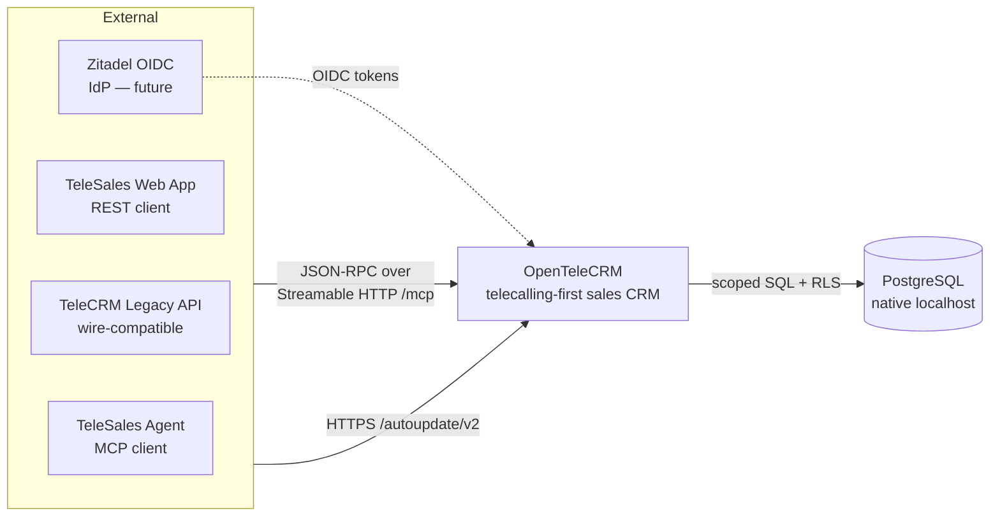
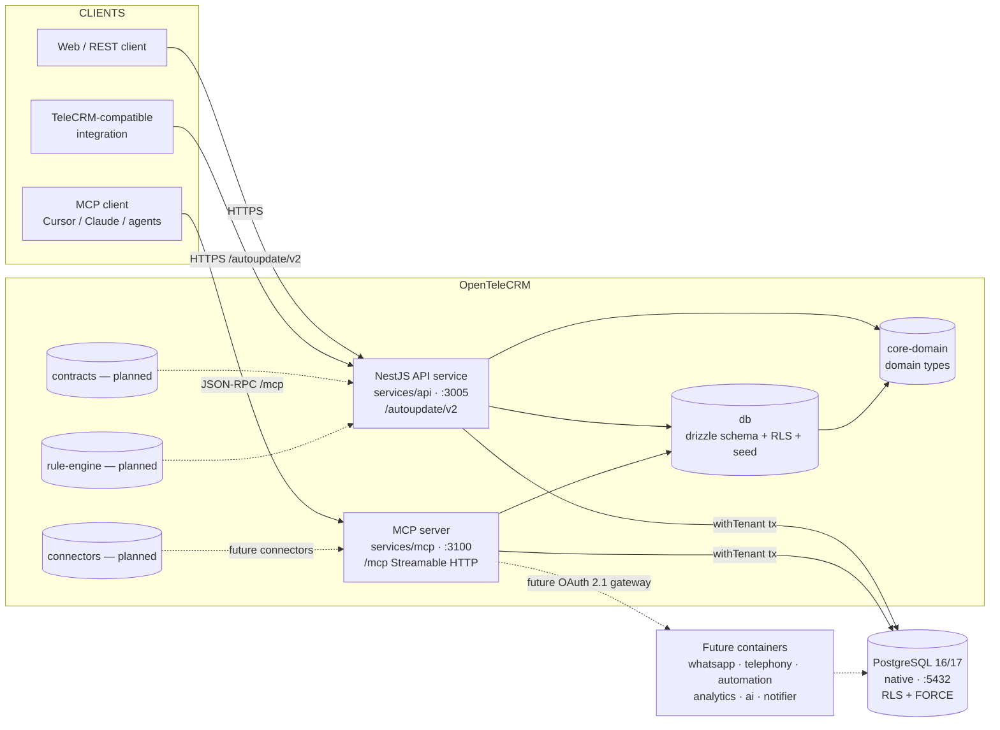
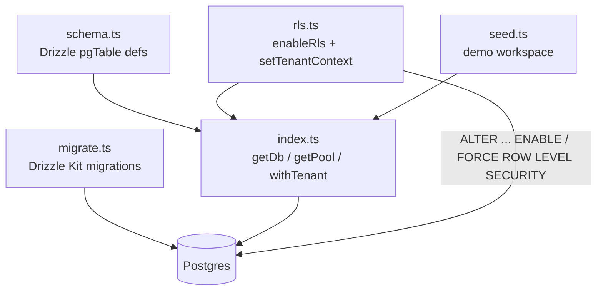
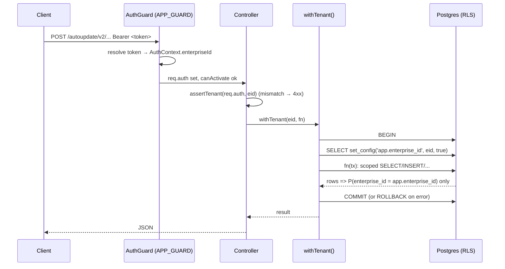

# OpenTeleCRM — Architecture

OpenTeleCRM (`opentelecrm` v0.1.0) is a 1:1 FOSS clone of TeleCRM, a telecalling-first
sales CRM. It is multi-tenant from line one, self-hosted **natively** (no Docker —
operator directive), and designed so every tenant can only observe its own rows.

This document uses the C4 model: **L1 system context**, **L2 containers**,
**L3 components**. Diagrams are Mermaid; render them in any Mermaid-capable viewer.

---

## Foundations

- **Workspace**: pnpm monorepo (`pnpm@9.15.4`), task orchestration via `turbo` (`turbo run …`).
- **Runtime**: Node.js ≥ 22, ESM-only (`"type": "module"` everywhere).
- **Package layout**: `packages/*` (framework-agnostic libs) + `services/*` (runnable servers).
- **Data**: PostgreSQL, native install, Drizzle ORM + Drizzle Kit, RLS per tenant.
- **Build/dev tooling**: TypeScript 5.7, Biome 1.9 (lint/format), Vitest (API tests),
  tsc for typecheck. Bootstrap via `make bootstrap` → `provision install db-init db-migrate db-seed`.

> Postgres note: the provisioner (`scripts/provision/debian.sh`) currently installs
> **PostgreSQL 16**. The migration target is **17**; step the distro package when ready.
> No Docker at any layer — binaries and systemd units only.

---

## L1 — System Context



The OpenTeleCRM system exposes **two parity surfaces** to clients (see L2):
a REST API wire-compatible with TeleCRM's `/autoupdate/v2` sync API, and an MCP
server exposing 13 tools with TeleCRM-identical names and schemas. Both read the
same Postgres database, always through the tenant-scoped `withTenant()` path so
RLS enforces isolation.

---

## L2 — Containers



**Implemented containers (today):**

| Container | Path | Port | Protocol | Role |
|-----------|------|------|----------|------|
| NestJS API service | `services/api` | `3005` (dev script) | HTTPS, REST | TeleCRM `/autoupdate/v2` parity REST surface |
| MCP server | `services/mcp` | `3100` | JSON-RPC, Streamable HTTP / `POST /mcp` + SSE | 13 TeleCRM-parity tools |
| `core-domain` | `packages/core-domain` | — | TS lib | Domain types mirroring TeleCRM's model |
| `db` | `packages/db` | — | TS lib | Drizzle schema, RLS bootstrap, migrations, seed |

**Planned containers / packages:**

- `contracts` (`packages/contracts`) — shared zod schemas for async/sync API bodies.
- `rule-engine` (`packages/rule-engine`) — lead routing / assignment logic.
- `connectors` (`packages/connectors`) — WhatsApp (Baileys), telephony adapters.
- `whatsapp`, `telephony`, `automation` (Temporal), `analytics` (ClickHouse),
  `ai`, `notifier` — future service containers (see L2 dashed boxes).

---

## L3 — Components

### NestJS API service (`services/api`)

```mermaid
flowchart TD
  IN[HTTP request<br/>Authorization: Bearer ...]
  AH[AuthGuard<br/>global APP_GUARD]
  PUB{@Public?}
  H[HealthController<br/>/health]
  MD[MetadataController<br/>/enterprise/:eid/{metadata,<br/>custom-fields,<br/>lead-stage-pipeline}]
  DM[DatabaseModule<br/>Global · DB_PROVIDER<br/>+ TENANT_WRAPPER]
  WT[withTenant eid<br/>BEGIN + SET app.enterprise_id]
  Pg[(Postgres<br/>RLS <enterprise_id>)]

  IN --> AH
  AH --> PUB
  PUB -- yes --> H
  PUB -- no --> MD
  MD -->|assertTenant req.auth==eid| DM
  DM --> WT
  WT -->|scoped drizzle tx| Pg
  AH -->|resolve token→enterprise| DM
```

Components, by function:

- **`AuthGuard`** (`src/auth/auth.guard.ts`) — registered as the global
  `APP_GUARD`. Resolves a `Bearer` token into an `AuthContext`
  (`enterpriseId`, optional `userId`, `tokenType`, optional `apiTokenId`).
  Accepts, in order:
  1. **TeleCRM-style API tokens** — `telekrm_async_<uuid>` / `telekrm_sync_<uuid>`.
  2. **Dev JWT** — HS256, secret from `DEV_JWT_SECRET`, used in local dev.
  3. **Zitadel OIDC id-token** — RS256, issuer-checked via `ZITADEL_ISSUER`
     (guarded; lands fully in the auth phase).
  Routes are excludable with `@Public()` (`src/auth/public.decorator.ts`).
- **`DatabaseModule`** (`src/db/database.module.ts`) — `@Global()`, provides the
  shared Drizzle `db` (`DB_PROVIDER`) and the `withTenant` wrapper
  (`TENANT_WRAPPER`). Every controller reads through it. Uses `getDb()`/
  `withTenant()` from `@opentelecrm/db`.
- **`MetadataController`** (`src/metadata/metadata.controller.ts`) — parity
  metadata surface under `enterprise/:eid`:
  `GET …/metadata`, `GET …/custom-fields`, `GET …/lead-stage-pipeline`.
  Each handler calls `assertTenant(req, eid)` (rejects mismatched tenant) then
  `withTenant(eid, …)`.
- **`HealthController`** (`src/health/health.controller.ts`) — `@Public()`
  `GET /health`, excluded from the global prefix.

**Global path prefix**: `API_BASE_PATH` defaults to `/autoupdate/v2`
(`/health` excluded) — TeleCRM sync-API parity.

### MCP server (`services/mcp`)

```mermaid
flowchart TD
  C[MCP client]
  T[StreamableHTTPServerTransport<br/>POST /mcp · SSE responses]
  S[McpServer 'opentelecrm' v0.1.0]
  TC{tenant() → withTenant ENTERPRISE_ID}
  DB[(Postgres<br/>RLS <enterprise_id>)]
  T2[13 parity tools]

  C -->|JSON-RPC| T
  T --> S
  S --> T2
  T2 --> TC
  TC --> DB
```

- **Transport**: Streamable HTTP (`StreamableHTTPServerTransport`) on a raw
  Node `http` server. `POST /mcp`; responses over SSE; CORS permissive
  (`*`) for in-browser clients. Sessionless ("stateless") mode —
  session id only kept when the SDK establishes one.
- **Tenant scoping**: every tool wraps its query in `tenant()` →
  `withTenant(ENTERPRISE_ID, fn)`, so RLS scopes all reads. Enterprise id is
  read from `MCP_ENTERPRISE_ID` (dev default `<fixed demo id>`). No cross-tenant
  leakage by construction, even though the current build is a single-tenant dev
  mode keyed off env.
- **Auth plan**: the tool surface is transport-agnostic. Planned gateway is
  **OAuth 2.1 + PKCE + Dynamic Client Registration** on **Zitadel**, deferred to
  the auth phase.

**13 TeleCRM-parity tools** (names & schemas match TeleCRM):

```
get_workspace_identity        list_lead_fields
get_lead_field_schema         list_actions
get_action_schema             get_lead_stages_and_lost_reasons
list_team_members             fetch_lead
query_leads                   fetch_lead_action
query_lead_actions            get_current_date
get_workspace_context
```

These map onto the `@opentelecrm/db` schema (`enterprise`, `lead`, `leadField`,
`action`, `actionType`, `pipeline`, `stage`, `lostReason`, `teamMember`, `user`).

### `core-domain` (`packages/core-domain`)

Framework-agnostic TypeScript interfaces that mirror TeleCRM's data model so
integrations stay wire-compatible. All entities are enterprise-scoped.
Exports: `Enterprise`, `User`, `TeamMember`, `Role`, `Lead`, `LeadField`,
`Pipeline`, `Stage`, `LostReason`, `ActionType`, `Action`, `ApiToken`,
`AuditLog`, plus RBAC role kinds (`owner | admin | manager | team_lead | agent |
read_only | custom`) and permission codes.

### `db` (`packages/db`)



- **`schema.ts`** — Drizzle schema, 13 tables. `.id` (`uuid`, `defaultRandom`),
  `.enterpriseId` FK cascade pattern, jsonb for `permissions` / `customFields` /
  `config` / `payload` / `before|after`, `created_at/updated_at` defaults, plus
  indexes (always tenant-led, e.g. `lead_ent_idx`, `lead_pipe_stage_idx`).
  Tables: `enterprise`, `user`, `role`, `teamMember`, `pipeline`, `stage`,
  `lostReason`, `leadField`, `lead`, `actionType`, `action`, `apiToken`,
  `auditLog`.
- **`rls.ts`** — `enableRls(db)` enables RLS, applies `FORCE ROW LEVEL SECURITY`,
  and creates the single policy `enterprise_isolation` on the 11 tenanted tables
  (`TENANT_TABLES`): `USING` / `WITH CHECK (enterprise_id::text =
  current_setting('app.enterprise_id', true))`. The TEXT cast avoids a uuid cast
  error on an unset pooled variable — unset ⇒ NULL ⇒ 0 rows, safely. `enterprise`
  and `user` are not tenant-scoped (no `enterprise_id`). `setTenantContext(eid)`
  emits `SELECT set_config('app.enterprise_id', …)`.
- **`index.ts`** — shared `pg.Pool` (max 10), `getDb()` (Drizzle `node-postgres`),
  and **`withTenant`**: `BEGIN` → `set_config('app.enterprise_id', eid, true)` →
  run `fn(tx)` → `COMMIT` (or `ROLLBACK`), always releasing the client. This is
  the **only** sanctioned read/write path for tenanted data.
- **`seed.ts`** — idempotent demo generator: 1 enterprise **"Acme Demo
  Workspace"**, 3 users (+ team members: Owner/Admin/Agent), 2 pipelines
  (Default Sales, Support), **20 custom fields**, **5,000 leads** (streamed,
  deterministic), and system action types.
- **Migrations** — `drizzle-kit generate` → SQL under `packages/db/drizzle/`.

`apiToken`.`type` is `'async' | 'sync'` and is **not interchangeable** (TeleCRM
parity) — the basis of the async/sync API parity plan.

---

### Data flow — request to RLS-scoped query



The invariant: a missing or invalid `app.enterprise_id` yields **zero rows**,
so there is no cross-tenant leakage path even if a caller passes a wrong tenant
id. The `opentelecrm` DB role is **not** a superuser/owner, and RLS is `FORCE`d,
so even the table owner obeys the policy.

---

## Async / Sync API parity plan

TeleCRM exposes two API families; OpenTeleCRM tracks both, and the token table
records which family a credential belongs to (`apiToken.type`, strict):

- **Sync API** — blocking HTTP at global prefix **`/autoupdate/v2`**. This is the
  implemented surface today (`MetadataController` + `HealthController`).
- **Async API** — the future `/autoupdate/v2` async counterparts. Sync tokens
  and async tokens are **not interchangeable**; an async token returns a job
  reference and the operation completes out-of-band (a future worker — see
  `automation`/Temporal container). The `contracts` package (planned) will hold
  the shared request/response/callback schema for both families.

Wire-compat is enforced today at the **contract test** layer
(`services/api/src/__tests__/metadata.contract.test.ts`,
`vitest.contract.config.ts`) before any sync route ships.

---

## MCP transport

- **Streamable HTTP** (`services/mcp/src/index.ts`): single HTTP POST endpoint
  `/mcp`, JSON-RPC 2.0, server-to-client messages over SSE. CORS headers for
  GET/POST/OPTIONS. Stateless by default; the SDK manages a session id when a
  client session is established.
- Request body parsing is delegated to the transport (`handleRequest(req, res)`
  — the third argument is the parsed body, **not** headers; passing headers there
  breaks JSON-RPC parsing with error `-32700`).
- Future auth: OAuth 2.1 + PKCE + Dynamic Client Registration backed by Zitadel
  (the `AuthGuard` OIDC path is the API-side counterpart).

---

## Future containers

| Container | Tech | Notes |
|-----------|------|-------|
| `whatsapp` | Node + Baileys | Inbound/outbound WhatsApp across tenants |
| `telephony` | Asterisk / PSTN adapters | Call state, dial-out, recording |
| `automation` | **Temporal** | Async job execution, workflows, retries |
| `analytics` | **ClickHouse** | Reporting over lead/action/audit data |
| `ai` | faster-whisper / Piper / XTTS | Transcription & voice generation |
| `notifier` | — | Email/sms/push events (Valkey pub/sub) |

Planned shared infra: **Zitadel** (OIDC + MCP auth), **OpenFGA** (fine-grained
authorization over RBAC roles), **Valkey** (pub/sub + caching; replaces Redis in
prod — RSAL concern), **NATS** (service messaging), **Meilisearch** (lead search).

---

## Ports & run targets (native dev)

| Thing | Value |
|-------|-------|
| API HTTP | `:3005` (`services/api/dev.sh`, `PORT_OVERRIDE`) |
| MCP HTTP | `:3100`, path `/mcp` (`services/mcp/dev.sh`) |
| Postgres | `127.0.0.1:5432/opentelecrm` (role `opentelecrm`, non-owner) |
| Node toolchain | v22.23.1 (nvm), `tsx` watch dev runner |
| Bootstrap | `make bootstrap` / `setup` (no root; sudo-only steps) |
| Service mgmt | systemd user units `opentelecrm-*` (`make status`) |