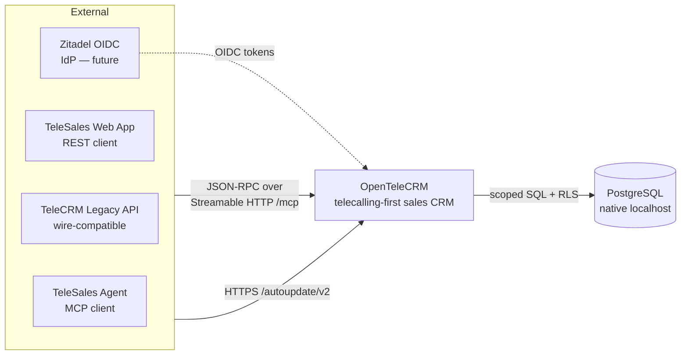
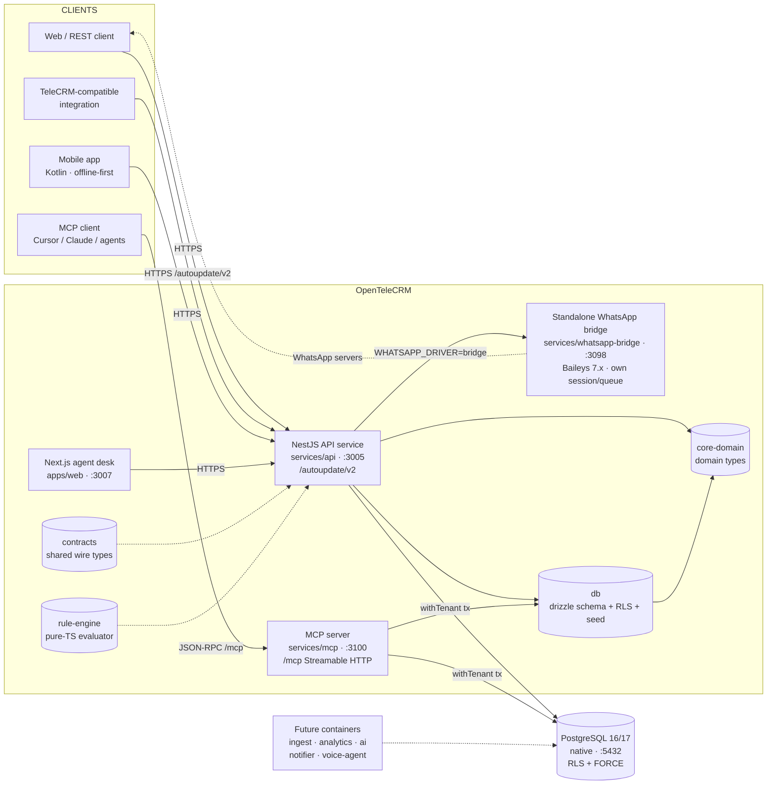
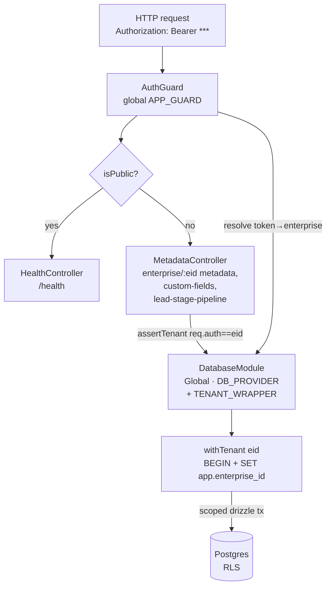
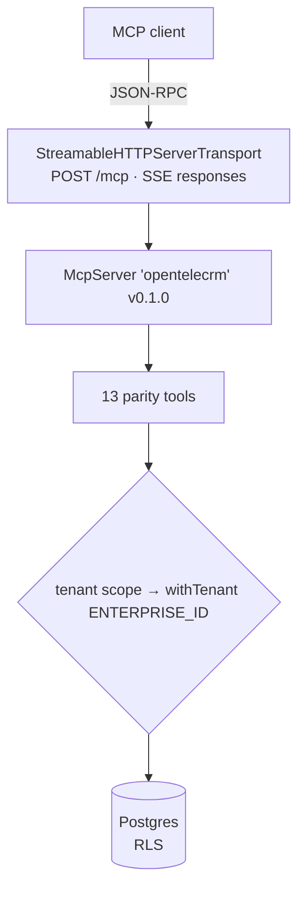
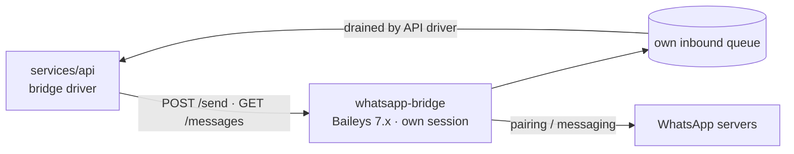
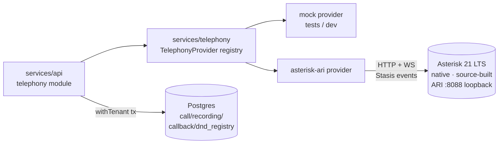
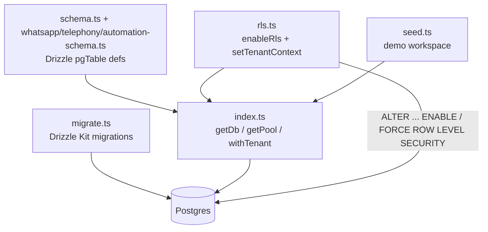
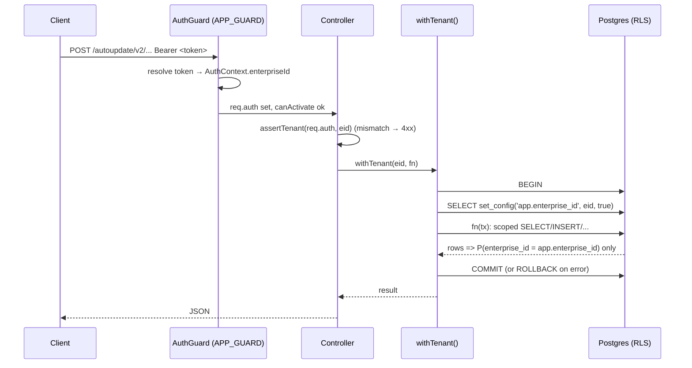

# OpenTeleCRM — Architecture

OpenTeleCRM (`opentelecrm` v0.1.0) is a 1:1 FOSS clone of TeleCRM, a telecalling-first
sales CRM. It is multi-tenant from line one, self-hosted **natively** (no Docker —
operator directive), and designed so every tenant can only observe its own rows.

This document uses the C4 model: **L1 system context**, **L2 containers**,
**L3 components**. Diagrams are Mermaid; render them in any Mermaid-capable viewer.

---

## Foundations

- **Workspace**: pnpm monorepo (`pnpm@9.15.4`), task orchestration via `turbo` (`turbo run …`).
- **Runtime**: Node.js ≥ 22, ESM-only (`"type": "module"` everywhere).
- **Package layout**: `packages/*` (framework-agnostic libs) + `services/*` (runnable servers).
- **Data**: PostgreSQL, native install, Drizzle ORM + Drizzle Kit, RLS per tenant.
- **Build/dev tooling**: TypeScript 5.7, Biome 1.9 (lint/format for services + packages;
  `apps/web` uses eslint), Vitest (API tests), tsc for typecheck.
  Bootstrap via `make setup` → `provision install db-init db-migrate db-seed`.

> Postgres note: the provisioner (`scripts/provision/debian.sh`) installs
> **PostgreSQL 16**; this host runs **17.10** (the migration target). Both are
> supported by the migrations. No Docker at any layer — binaries and systemd
> units only.

---

## L1 — System Context



The OpenTeleCRM system exposes **two parity surfaces** to clients (see L2):
a REST API wire-compatible with TeleCRM's `/autoupdate/v2` sync API, and an MCP
server exposing 13 tools with TeleCRM-identical names and schemas. Both read the
same Postgres database, always through the tenant-scoped `withTenant()` path so
RLS enforces isolation.

---

## L2 — Containers



**Implemented containers (today):**

| Container | Path | Port | Protocol | Role |
|-----------|------|------|----------|------|
| NestJS API service | `services/api` | `3005` (dev script) | HTTPS, REST | TeleCRM `/autoupdate/v2` parity REST surface (sync + async + metadata + whatsapp + telephony + automation + sequences) |
| MCP server | `services/mcp` | `3100` | JSON-RPC, Streamable HTTP / `POST /mcp` + SSE | 13 TeleCRM-parity tools |
| WhatsApp drivers | `services/whatsapp` | — | TS lib | mock / wwebjs / baileys / bridge drivers behind `WhatsAppProvider` |
| Standalone WhatsApp bridge | `services/whatsapp-bridge` | `3098` | HTTP | Deploy-anywhere Baileys 7.x bridge — own session + own inbound queue (`/health`, `/send`, `/messages`, `/typing`) |
| Telephony | `services/telephony` | — | TS lib | Dialer scoring + mock / asterisk-ari providers (live ARI) |
| Web agent desk | `apps/web` | `3007` | Next.js | Dashboard, leads, inbox, dialer, automations (+ React Flow builder), sequences, webhooks, broadcasts, templates, callbacks, settings |
| Mobile app | `apps/mobile` | — | Android (Kotlin) | Offline-first agent client: leads, dialer + caller-ID, WhatsApp inbox, team, settings |
| `core-domain` | `packages/core-domain` | — | TS lib | Domain types mirroring TeleCRM's model |
| `contracts` | `packages/contracts` | — | TS lib | Shared zod/TS wire types (WhatsApp/Telephony/Automation) |
| `rule-engine` | `packages/rule-engine` | — | TS lib | Pure-TS automation evaluator (no I/O) |
| `db` | `packages/db` | — | TS lib | Drizzle schema, RLS bootstrap, migrations (0000–0007), seed |

**Planned containers / packages:**

- `connectors` (`packages/connectors`) — lead-capture connectors (P5); empty scaffold.
- `ingest`, `analytics` (ClickHouse), `ai`, `notifier`, `voice-agent` —
  future service containers (see RQ); empty scaffolds today.
- `infra/native` — binary installer homes (Temporal, ClickHouse, Zitadel) built in their phases.

---

## L3 — Components

### NestJS API service (`services/api`)



Components, by function:

- **`AuthGuard`** (`src/auth/auth.guard.ts`) — registered as the global
  `APP_GUARD`. Resolves a `Bearer` token into an `AuthContext`
  (`enterpriseId`, optional `userId`, `tokenType`, optional `apiTokenId`).
  Accepts, in order:
  1. **TeleCRM-style API tokens** — `telekrm_async_<uuid>` / `telekrm_sync_<uuid>`,
     stored as SHA-256 hashes, class-enforced (async ≠ sync → 401 `NOT_AUTHORIZED`).
  2. **Dev JWT** — HS256, secret from `DEV_JWT_SECRET`, used in local dev.
  3. **Enterprise-secret exchange** — `POST /auth/exchange` mints a sync token
     from the seeded demo secret (mobile onboarding, migration 0007).
  4. **Zitadel OIDC id-token** — RS256, issuer-checked via `ZITADEL_ISSUER`
     (guarded; lands fully in the auth phase).
  Routes are excludable with `@Public()` (`src/auth/public.decorator.ts`).
- **`DatabaseModule`** (`src/db/database.module.ts`) — `@Global()`, provides the
  shared Drizzle `db` (`DB_PROVIDER`) and the `withTenant` wrapper
  (`TENANT_WRAPPER`). Every controller reads through it. Uses `getDb()`/
  `withTenant()` from `@opentelecrm/db`.
- **`MetadataController`** (`src/metadata/metadata.controller.ts`) — parity
  metadata surface under `enterprise/:eid`:
  `GET …/metadata`, `GET …/custom-fields`, `GET …/lead-stage-pipeline`.
  Each handler calls `assertTenant(req, eid)` (rejects mismatched tenant) then
  `withTenant(eid, …)`.
- **Feature modules** — tokens, sync (leads/actions/team/meta), async ingest,
  whatsapp (inbox/broadcasts/templates), telephony (calls/caller-id/dialer/
  callbacks/recordings), automation (rules/distribution/webhook/scheduler/
  sequences/quota/audit). All route through `assertTenant` + `withTenant`.
- **`HealthController`** (`src/health/health.controller.ts`) — `@Public()`
  `GET /health`, excluded from the global prefix.

**Global path prefix**: `API_BASE_PATH` defaults to `/autoupdate/v2`
(`/health` is the only excluded route — the public webhook endpoints
`/webhook/:tenantId/:name` live UNDER the prefix: `POST /autoupdate/v2/webhook/...`)
— TeleCRM sync-API parity.

### MCP server (`services/mcp`)



- **Transport**: Streamable HTTP (`StreamableHTTPServerTransport`) on a raw
  Node `http` server. `POST /mcp`; responses over SSE; CORS permissive
  (`*`) for in-browser clients. Sessionless ("stateless") mode —
  session id only kept when the SDK establishes one.
- **Tenant scoping**: every tool wraps its query in `tenant()` →
  `withTenant(ENTERPRISE_ID, fn)`, so RLS scopes all reads. Enterprise id is
  read from `MCP_ENTERPRISE_ID` (dev default `<fixed demo id>`). No cross-tenant
  leakage by construction, even though the current build is a single-tenant dev
  mode keyed off env.
- **Auth plan**: the tool surface is transport-agnostic. Planned gateway is
  **OAuth 2.1 + PKCE + Dynamic Client Registration** on **Zitadel**, deferred to
  the auth phase (divergence D3 — long-lived refresh tokens).

**13 TeleCRM-parity tools** (names & schemas match TeleCRM):

```
get_workspace_identity        list_lead_fields
get_lead_field_schema         list_actions
get_action_schema             get_lead_stages_and_lost_reasons
list_team_members             fetch_lead
query_leads                   fetch_lead_action
query_lead_actions            get_current_date
get_workspace_context
```

These map onto the `@opentelecrm/db` schema (`enterprise`, `lead`, `leadField`,
`action`, `actionType`, `pipeline`, `stage`, `lostReason`, `teamMember`, `user`).

### `core-domain` (`packages/core-domain`)

Framework-agnostic TypeScript interfaces that mirror TeleCRM's data model so
integrations stay wire-compatible. All entities are enterprise-scoped.
Exports: `Enterprise`, `User`, `TeamMember`, `Role`, `Lead`, `LeadField`,
`Pipeline`, `Stage`, `LostReason`, `ActionType`, `Action`, `ApiToken`,
`AuditLog`, plus RBAC role kinds (`owner | admin | manager | team_lead | agent |
read_only | custom`) and permission codes.

### Standalone WhatsApp bridge (`services/whatsapp-bridge`)



A self-contained Baileys 7.x bridge exposing a tiny HTTP API (`/health`,
`/send`, `/messages` drain, `/typing`) with its own file-backed session and its
own inbound queue — deployable on any Linux host independent of the monorepo.
Baileys 7.x pairs business/smba numbers that 6.x rejects (401). systemd unit:
`infra/whatsapp-bridge/opentelecrm-whatsapp-bridge.service`.

### Telephony (`services/telephony` + `infra/asterisk`) — live



- **`TelephonyProvider`** (`packages/contracts`) — the provider boundary: `dial`,
  `hangup`, `callState`, `startRecording`, `stopRecording`, `on`. Mock provider
  serves tests; the `asterisk-ari` provider is live (throws unless
  `TELEPHONY_ARI_*` env is set — fail loudly, never silent no-op).
- **Live dialing (P4b)**: `POST /dialer/:leadId/dial` originates a real call
  through ARI (`/ari/channels`, channel vars `enterprise_id`/`lead_id`) and
  writes a `call` row with `provider_call_id` (migration 0006). The
  `CallEventBridge` subscribes to Stasis over WebSocket and maps
  `StasisStart`/`ChannelStateChange`/`ChannelDestroyed` → call row updates
  (ringing → in-progress → completed). A real SIP trunk is operator config
  (`TELEPHONY_ARI_TRUNK`).
- **Dialer scoring** (`scoring.ts`) — pure functions (`scoreDialerCandidate`,
  `sortDialerCandidates`, `callingWindowAllowed`): follow-up due > SLA breach >
  lead score > freshness > round-robin; TRAI window 09:00–21:00 IST enforced
  (ADR-0027/ADR-0029); `dnd_registry` suppresses DND numbers in `dialer/next`.
- **API module** (`services/api/src/telephony/`) — calls (A1.3), caller-id
  (A1.6), dialer (A1.1), callbacks (A1.5), recordings (A1.2 partial) — all
  through `withTenant(eid, …)`.
- **PBX** (`infra/asterisk/`) — Debian 13 ships no asterisk binary, so the repo
  builds **Asterisk 21 LTS from source**
  (`infra/asterisk/provision/build-asterisk-source.sh`); `ari.conf` (loopback,
  user `opentelecrm`), `pjsip.conf`, `extensions.conf` (Stasis app
  `opentelecrm`), systemd unit. The MixMonitor recording pipeline is the
  remaining P3 follow-up.

### `db` (`packages/db`)



- **Schema** — Drizzle schema split by domain: `schema.ts` (13 core tables:
  `enterprise`, `user`, `role`, `teamMember`, `pipeline`, `stage`, `lostReason`,
  `leadField`, `lead`, `actionType`, `action`, `apiToken`, `auditLog`),
  `whatsapp-schema.ts` (6: `wa_session`, `conversation`, `wa_message`,
  `wa_template`, `wa_broadcast`, `consent_ledger`), `telephony-schema.ts`
  (4: `call`, `recording`, `callback`, `dnd_registry`), `automation-schema.ts`
  (7: `automation`, `automation_run`, `automation_step`, `sequence`,
  `sequence_step`, `sequence_run`, `automation_quota`). **30 tables total, 28
  tenant-scoped.** `.id` (`uuid`, `defaultRandom`), `.enterpriseId` FK cascade
  pattern, jsonb for `permissions` / `customFields` / `config` / `payload` /
  `before|after`, `created_at/updated_at` defaults, plus indexes (always
  tenant-led, e.g. `lead_ent_idx`, `lead_pipe_stage_idx`).
- **`rls.ts`** — `enableRls(db)` enables RLS, applies `FORCE ROW LEVEL SECURITY`,
  and creates the single policy `enterprise_isolation` on the **28 tenanted
  tables** via the registries `TENANT_TABLES` (11 core), `WHATSAPP_TENANT_TABLES`
  (6), `TELEPHONY_TENANT_TABLES` (4), `AUTOMATION_TENANT_TABLES` (7):
  `USING` / `WITH CHECK (enterprise_id::text =
  current_setting('app.enterprise_id', true))`. The TEXT cast avoids a uuid cast
  error on an unset pooled variable — unset ⇒ NULL ⇒ 0 rows, safely. `enterprise`
  and `user` are not tenant-scoped (no `enterprise_id`).
  `setTenantContext(eid)` emits `SELECT set_config('app.enterprise_id', …)`.
- **`index.ts`** — shared `pg.Pool` (max 10), `getDb()` (Drizzle `node-postgres`),
  and **`withTenant`**: `BEGIN` → `set_config('app.enterprise_id', eid, true)` →
  run `fn(tx)` → `COMMIT` (or `ROLLBACK`), always releasing the client. This is
  the **only** sanctioned read/write path for tenanted data.
- **`seed.ts`** — idempotent demo generator: 1 enterprise **"Acme Demo
  Workspace"**, 3 users (+ team members: Owner/Admin/Agent), 2 pipelines
  (Default Sales, Support), **20 custom fields**, **5,000 leads** (streamed,
  deterministic), system action types, and (P4) 10 automation templates
  (`seed:templates`).
- **Migrations** — `drizzle-kit generate` → SQL under `packages/db/drizzle/`
  (`0000…0007`: 0000 spine, 0001 whatsapp, 0002 telephony, 0003 automation,
  0004 sequences, 0005 automation_quota, 0006 `provider_call_id`,
  0007 `enterprise.secret_hash`).

`apiToken`.`type` is `'async' | 'sync'` and is **not interchangeable** (TeleCRM
parity) — the basis of the async/sync API parity plan.

---

### Data flow — request to RLS-scoped query



The invariant: a missing or invalid `app.enterprise_id` yields **zero rows**,
so there is no cross-tenant leakage path even if a caller passes a wrong tenant
id. The `opentelecrm` DB role is **not** a superuser/owner, and RLS is `FORCE`d,
so even the table owner obeys the policy.

---

## Async / Sync API parity

TeleCRM exposes two API families; OpenTeleCRM tracks both, and the token table
records which family a credential belongs to (`apiToken.type`, strict):

- **Sync API** — blocking HTTP at global prefix **`/autoupdate/v2`**:
  leads CRUD + upsert-by-identifier + search, actions batch CRUD + search
  (bare-numeric custom codes), team-members + state_change, custom-actions +
  custom-fields PATCH. Per-item status `CREATED|IGNORED|UPDATED|REJECTED` +
  `remarks[]`; search = POST + 200.
- **Async API** — fire-and-forget `POST /enterprise/{eid}/autoupdatelead` →
  200 + `requestId`; `?validate=true` dry-run (zero writes); `X-Strict-Mode:
  true` → 422; `ACTION_`-prefix normalization; `GET
  /enterprise/{eid}/ingest/:requestId` per-field outcomes (in-memory ingest log
  today — queue persistence later). Sync and async tokens are **not
  interchangeable**.

Wire-compat is enforced at the **contract test** layer
(`services/api/src/__tests__/*.contract.test.ts`,
`vitest.contract.config.ts`) — 103 tests across 13 files, all through
`authGuard` + RLS, no mocking.

---

## MCP transport

- **Streamable HTTP** (`services/mcp/src/index.ts`): single HTTP POST endpoint
  `/mcp`, JSON-RPC 2.0, server-to-client messages over SSE. CORS headers for
  GET/POST/OPTIONS. Stateless by default; the SDK manages a session id when a
  client session is established.
- Request body parsing is delegated to the transport (`handleRequest(req, res)`
  — the third argument is the parsed body, **not** headers; passing headers there
  breaks JSON-RPC parsing with error `-32700`).
- Future auth: OAuth 2.1 + PKCE + Dynamic Client Registration backed by Zitadel
  (the `AuthGuard` OIDC path is the API-side counterpart).

---

## Future containers

| Container | Tech | Notes |
|-----------|------|-------|
| `ingest` | — | P5 lead-capture connectors (26+ sources); `packages/connectors` home — empty scaffold |
| `analytics` | **ClickHouse** | Reporting over lead/action/audit data (P6, ADR-0005) — empty scaffold |
| `ai` | faster-whisper / Piper / XTTS | Transcription & voice generation (P7, ADR-0016/17/18) — empty scaffold |
| `voice-agent` | LiveKit / Pipecat | AI voice agent → Asterisk SIP (P7) — empty scaffold |
| `notifier` | Valkey pub/sub | Email/sms/push events — empty scaffold |
| `automation` | **Temporal** | Durable workflow engine (ADR-0007) — today automation runs in-process in `services/api` (60s cron tick); the Temporal worker home is `services/automation` |

Planned shared infra: **Zitadel** (OIDC + MCP auth), **OpenFGA** (fine-grained
authorization over RBAC roles), **Valkey** (pub/sub + caching; replaces Redis in
prod — RSAL concern), **NATS** (service messaging), **Meilisearch** (lead search).

---

## Workforce management (ByteCodeEMS port, 2026-08-10)

Parallel domain added to the same rails (RLS + audit + automation + web +
mobile). See docs/PARITY.md §A9, docs/ROADMAP.md §W1, ADR-0030.

- **Schema:** `packages/db/src/workforce-schema.ts` — department, attendance,
  eod_report, task, metric_definition, target, daily_metric_entry,
  weekly_report, device_call; `team_member` extended (department_id,
  manager_id, join_date, employment_status). 37 tenant tables, migrations
  0008/0009.
- **API:** `services/api/src/workforce/` — attendance (GPS check-in/out),
  eod, tasks, departments, metrics, reports + CSV exports, device-calls,
  GET /me, GET/PATCH /team (admin). `requireRole()` gate on top of the
  tenant-scoped AuthGuard.
- **Scheduling:** `WorkforceJobsService` (EOD cutoff 12:30 UTC Mon–Sat,
  Saturday weekly rollup, daily overdue-task sweep) hooked into the
  `AutomationScheduler` 60s tick behind UTC-shifted `isCronMatch` guards.
- **Automation:** 6 new trigger kinds (attendance_checked_in/out,
  eod_submitted/missed, task_assigned/overdue) — emitters in
  `workforce/events.ts`, fired after audit at controller call sites.
- **Web:** /attendance, /eod, /tasks, /reports, /admin/departments,
  /admin/team + role-gated Workforce/Admin nav groups (GET /me).
- **Mobile:** :feature:attendance (LocationManager GPS), :feature:eod,
  :feature:tasks, :feature:calls (SIM-aware CallLog import via
  PHONE_ACCOUNT_ID) + bottom NavigationBar.

---

## Web desk networking & supervision

**Runtime API-base derivation** (`apps/web/src/lib/config.ts` `getApiBase()`):
the desk resolves its API origin from `window.location` at request time, so
one bundle serves every surface — localhost, LAN IP, Tailnet (IP or hostname),
and the Cloudflare tunnel. When served from `crm.srishanth.com` it calls
`https://api.srishanth.com/autoupdate/v2`; everywhere else it calls the same
host on `:3005`. No build-time flag, no baked origin. CSP `connect-src` and the
API's CORS allowlist (`CORS_ORIGINS` in `.env`) both cover all four surfaces.

**Cross-platform supervision** — one portable launcher pair powers both OSes:

| Platform | Supervisor | Unit | Launcher |
|----------|-----------|------|----------|
| Linux | systemd | `infra/systemd/opentelecrm-{api,web}.service` | `infra/launchers/launch-{api,web}.sh` |
| macOS | launchd | `infra/macos/com.opentelecrm.{api,web}.plist` | same launchers |

The launchers resolve `node` dynamically (Homebrew → nvm → PATH), source
`.env`, and exec without a `--watch` flag so the supervisor can restart them
cleanly. Provisioning: `scripts/provision/debian.sh` (Linux) vs
`infra/macos/provision-brew.sh` (Homebrew). Full runbook:
[`infra/macos/README.md`](../infra/macos/README.md).

## Ports & run targets (native dev)

| Thing | Value |
|-------|-------|
| API HTTP | `:3005` (`services/api/dev.sh`, `PORT_OVERRIDE`) |
| MCP HTTP | `:3100`, path `/mcp` (`services/mcp/dev.sh`; code default `MCP_PORT` is 3101 — dev.sh pins 3100) |
| Web app | `:3007` (`apps/web`, `next dev -p 3007 -H 0.0.0.0`) |
| WhatsApp bridge | `:3098` (`services/whatsapp-bridge`) |
| Asterisk ARI | `127.0.0.1:8088` (loopback only, user `opentelecrm`) |
| Postgres | `127.0.0.1:5432/opentelecrm` (role `opentelecrm`, non-owner) |
| Node toolchain | v22.23.1 (nvm), `tsx` watch dev runner |
| Bootstrap | `make setup` (no root; sudo-only steps) |
